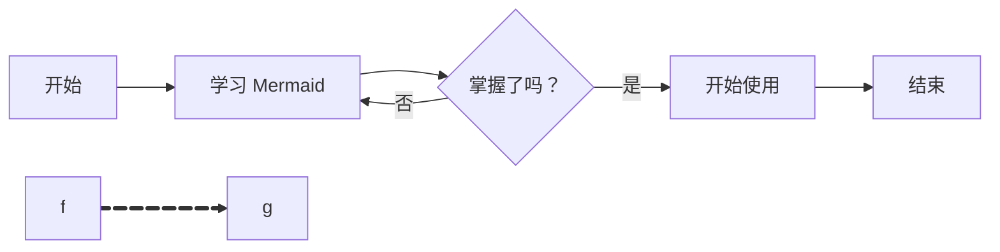
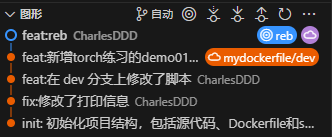

### 我的 Mermaid 图表示例

下面是一个流程图：

```mermaid
flowchart LR
    A[开始] --> B[学习 Mermaid]
    B --> C{掌握了吗？}
    C -->|是| D[开始使用]
    C -->|否| B
    D --> E[结束]
    %% 边ID用来后续加样式
    %% e1边ID
    f e1@ ==> g
    e1@{ animate: fast}
```
波浪线
<u>下划线</u>

